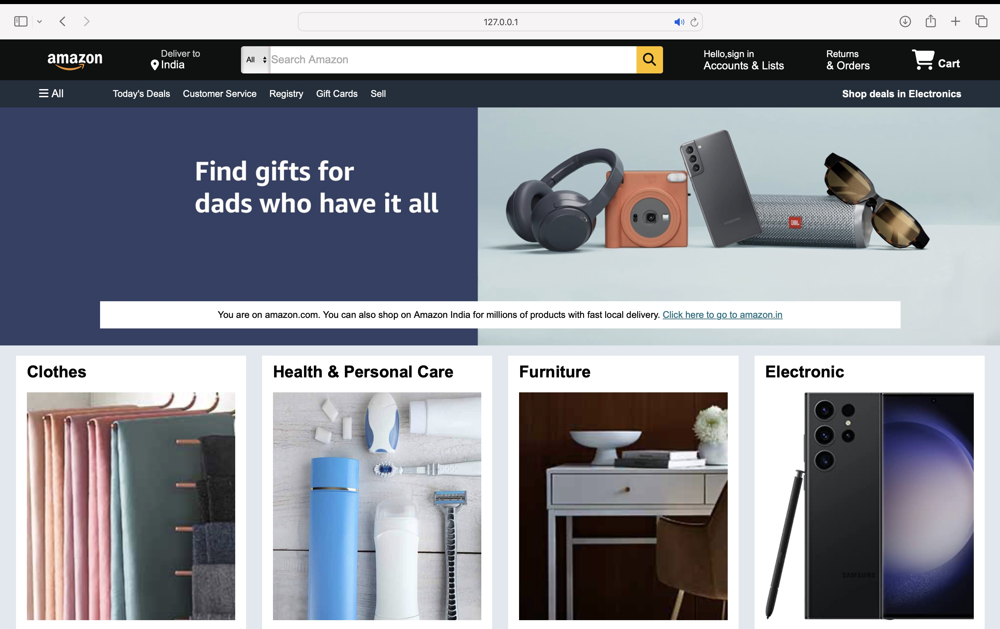
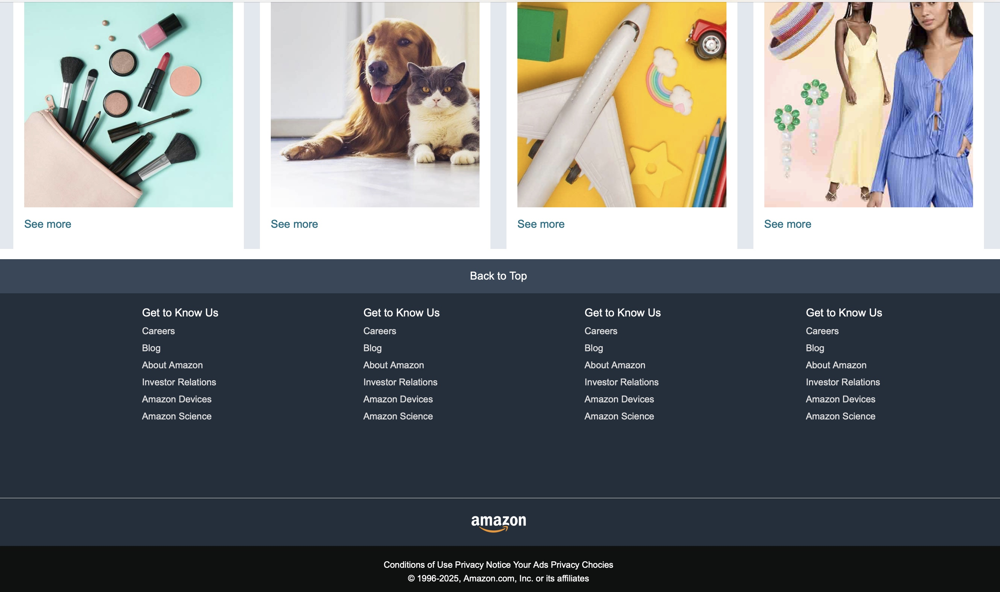

# 🛒 Amazon Clone - Homepage Project

This is a simple **Amazon-style homepage clone** built using **HTML** and **CSS**. It visually replicates Amazon's main landing page and is great for practicing frontend web development skills.

---

## 📸 Preview

---

## 🚀 Live Demo

To run the project:

1. Download or clone the repository
2. Open `index.html` in your browser

---

## 📁 Project Structure

---

## 🎨 Features

✅ Responsive **navigation bar** with:

- Logo  
- Location indicator  
- Search bar  
- Account & Cart icons  

✅ **Hero section** with promotional message and background image  
✅ **Shop section** with 8 product category boxes (clothing, electronics, furniture, etc.)  
✅ **Footer** with navigation links and branding

---

## 🛠️ Tech Stack

- **HTML5**
- **CSS3**
- [Font Awesome 6](https://fontawesome.com/) for icons (via CDN)

---

## ✨ Possible Improvements

Here are a few ideas for future enhancements:

- ✅ Add **mobile responsiveness**
- ✅ Use **JavaScript** to create a dynamic shopping cart
- ✅ Add hover animations on product boxes
- ✅ Fetch product data dynamically using **APIs**

---

